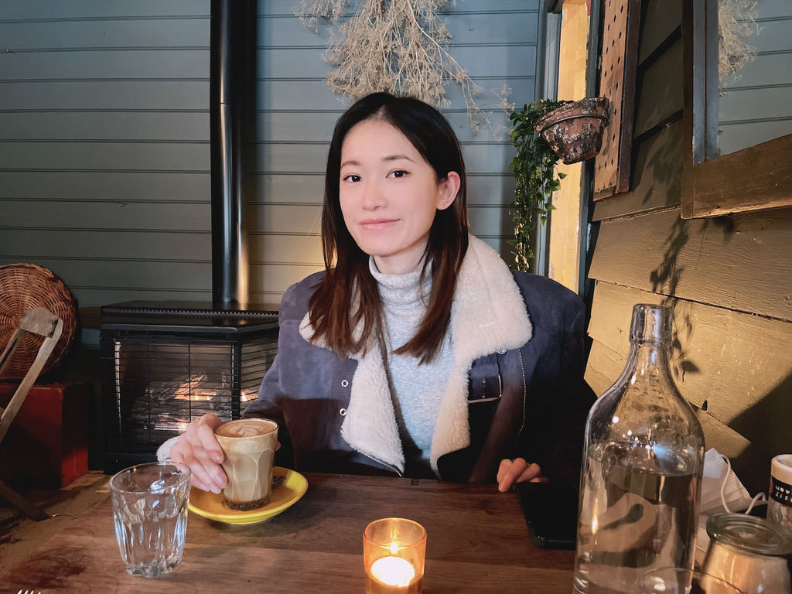

Hi! Thanks for coming by. I’m currently an aspiring UI/UX Designer studying a short course at RMIT, in the heart of Melbourne. I'm a creative who loves analysing and solving challenging problems with others. 

Previously, I completed a Masters in Multimedia Design from RMIT where I delved into design thinking and practice. But I first got hooked into design from going to drawing classes growing up.

Growing and learning new things excite me. Other than art, I really enjoy reading a good crime fiction novel, socialising if lockdown allows for it, and exploring new places on roadtrips. 

I am curently looking for new opportunities where I can make an impact and work harmonously with others. Please don't hesitate to reach out— I'm happy to chat!

##### Email: viv.zhong57@gmail.com